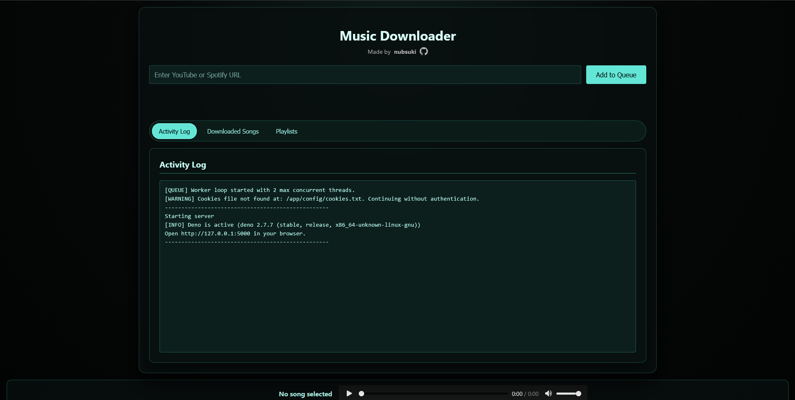

# Music Downloader 

A web-based music downloader application built with `yt-dlp` and `spotdl`.



## Features

- **Web Interface**: Clean and simple web UI for adding and monitoring downloads.
- **Unified Download**: Supports both **YouTube** and **Spotify** URLs via a single input.
- **M3U8 Playlist Support**: 
  - Automatically generates `.m3u8` playlists for YouTube and Spotify albums/playlists.
  - Supports **Unicode** (Japanese, Korean, etc.) correctly in Navidrome and VLC.
  - **Manual Creation**: Create custom playlists for existing songs via the UI modal.
- **YouTube Playlist Tracking Tab**:
  - Track **YouTube playlist URLs** with optional custom names.
  - Uses YouTube playlist IDs to prevent duplicates (even with different URLs).
  - Detects playlist changes using track IDs (added/removed/swapped songs), not only count.
  - Displays original playlist title (source title) under custom name.
  - Shows clickable YouTube playlist ID link to open the playlist in a new tab.
  - One-click resync with **Update** button and optional remove-from-tracking with optional `.m3u8` deletion.
  - Includes manual **Refresh Updates** button and automatic periodic checks (every 1 day).
- **Filename Sanitization**: 
  - Automatically transliterates non-ASCII characters to fix compatibility issues with Docker/Windows mounts.
  - Configurable via `RESTRICT_FILENAMES`.
- **Concurrent Downloads**: Multiple simultaneous downloads with configurable worker count.
- **Real-time Status**: Live download progress, activity logs, and status updates via a terminal-like UI.
- **Docker Support**: Containerized deployment with Docker and Docker Compose.
- **Delete Functionality**: Enable or disable delete UI and API endpoints for downloaded files.
- **Download Archive**: Use an archive file to skip already downloaded files based on file existence.
- **HTTP Basic Authentication**: Optional password protection to secure the web interface.

## Installation

### Using Docker

Run with Docker Compose:

#### Docker Compose Example

```yaml
services:
  music-downloader:
    container_name: music-downloader
    image: ghcr.io/nubsuki/music-downloader:latest
    ports:
      - "5000:5000"
    environment:
      - AUTH_USERNAME= # Optional: username for basic auth (leave empty to disable)
      - AUTH_PASSWORD= # Optional: password for basic auth (leave empty to disable)
      - ENABLE_DELETE=false # Toggle delete UI and API
      - USE_DOWNLOAD_ARCHIVE=false # "false": checks file existence | "true": uses archive.txt
      - MAX_WORKERS=3
      - RESTRICT_FILENAMES=true # Fixes VLC/Navidrome Unicode issues by forcing ASCII filenames for song files
      - PLAYLIST_RESTRICT_FILENAMES=false # Optional: if true, also restricts playlist .m3u8 filenames to ASCII (default keeps Unicode)
      - AUTO_PLAYLIST=false # Optional: if true, hides .m3u8 checkbox and auto-prompts playlist creation for playlist/album URLs
      - DOWNLOADER_COOKIES_PATH=/app/config/cookies.txt # Optional: for age-restricted content
      - DOWNLOADER_CONFIG_DIR=/app/config
      - ENABLE_SPOTIFY=true # Optional: set to false to disable Spotify functionality entirely
      - SPOTIPY_CLIENT_ID=your_spotify_client_id
      - SPOTIPY_CLIENT_SECRET=your_spotify_client_secret
    volumes:
      - ./downloads:/app/downloads
      - ./config:/app/config
    restart: unless-stopped
```

## Usage

1. Open your browser and navigate to `http://localhost:5000`
2. Paste a **YouTube** or **Spotify** URL in the input field.
3. Optional: Check the **.m3u8** box to generate a playlist file.
4. Optional: Set `AUTO_PLAYLIST=true` to hide the checkbox and auto-prompt playlist creation for playlist/album URLs.
5. Click "Add to Queue" to start downloading.
6. Use the **Playlists** tab to track YouTube playlists and keep `.m3u8` files in sync.
7. In **Playlists** tab:
   - Click **Refresh Updates** for a manual check.
   - Use **Update (+/-)** when changes are detected.
   - Use the delete icon to remove tracking, with optional `.m3u8` removal.

## API

### Download
**Endpoint:** `/api/download`  
**Methods:** `GET`, `POST`  
**Description:** Adds a URL to the download queue.

- **GET Example**: `curl "http://localhost:5000/api/download?url=URL"`
- **POST Example (JSON)**:
  ```bash
  curl -X POST http://localhost:5000/api/download \
       -H "Content-Type: application/json" \
       -d '{"url": "URL", "create_m3u": true}'
  ```

### Status & Logs
- **Get Status**: `GET /api/status` - Returns status of all queued/active downloads.
- **Get Logs**: `GET /api/logs?after=ID` - Returns real-time terminal output logs.

### File Management
- **List Files**: `GET /api/downloaded_files` - Returns a list of all downloaded MP3s.
- **Delete File**: `POST /api/delete_file` - Deletes a specific file (requires `ENABLE_DELETE=true`).
  ```bash
  curl -X POST http://localhost:5000/api/delete_file \
       -H "Content-Type: application/json" \
       -d '{"filename": "youtube/song.mp3"}'
  ```

### Playlists
- **Create Playlist**: `POST /api/create-playlist` - Creates a custom M3U8 for a URL.
  ```bash
  curl -X POST http://localhost:5000/api/create-playlist \
       -H "Content-Type: application/json" \
       -d '{"url": "URL", "name": "My Playlist", "overwrite": false}'
  ```

- **Tracked Playlists (YouTube-only)**:
  - `GET /api/tracked_playlists` - List tracked playlists and current change status.
  - `POST /api/tracked_playlists` - Add/update tracked playlist and sync state.
    ```bash
    curl -X POST http://localhost:5000/api/tracked_playlists \
         -H "Content-Type: application/json" \
         -d '{"url": "YOUTUBE_PLAYLIST_URL", "name": "My Custom Name"}'
    ```
  - `POST /api/tracked_playlists/ack-update` - Force resync a tracked playlist.
    ```bash
    curl -X POST http://localhost:5000/api/tracked_playlists/ack-update \
         -H "Content-Type: application/json" \
         -d '{"id": "pl-123"}'
    ```
  - `POST /api/tracked_playlists/delete` - Remove tracking, optionally delete `.m3u8` file.
    ```bash
    curl -X POST http://localhost:5000/api/tracked_playlists/delete \
         -H "Content-Type: application/json" \
         -d '{"id": "pl-123", "delete_m3u8": true}'
    ```

## Configuration

| Variable | Default | Description |
|----------|---------|-------------|
| `AUTH_USERNAME` | - | Username for HTTP Basic Authentication (leave empty to disable). |
| `AUTH_PASSWORD` | - | Password for HTTP Basic Authentication (leave empty to disable). |
| `MAX_WORKERS` | `3` | Number of concurrent downloads. |
| `RESTRICT_FILENAMES` | `false` | If `true`, forces song filenames to ASCII (fixes Unicode issues on Docker/Windows). |
| `AUTO_PLAYLIST` | `false` | If `true`, hides the `.m3u8` checkbox and automatically opens playlist creation for playlist/album URLs. |
| `ENABLE_DELETE` | `false` | Enables delete buttons in the UI and delete API endpoints (downloaded files + tracked playlist remove). |
| `ENABLE_SPOTIFY` | `true` | If `false`, disables all Spotify functionality completely. |
| `USE_DOWNLOAD_ARCHIVE` | `false` | Tracks downloaded IDs in `archive.txt` to prevent duplicates. |
| `DOWNLOADER_COOKIES_PATH` | - | Path to `cookies.txt` for age-restricted content. |
| `DOWNLOADER_CONFIG_DIR` | `/app/config` | Directory where the download archive and configs are stored. |
| `PLAYLIST_RESTRICT_FILENAMES` | `false` | If `true`, also restricts playlist `.m3u8` filenames to ASCII. Default `false` keeps Unicode playlist names. |
| `SPOTIPY_CLIENT_ID` | - | Required for Spotify downloads. |
| `SPOTIPY_CLIENT_SECRET` | - | Required for Spotify downloads. |

## Disclaimer

This tool is for educational purposes only. Ensure you have the right to download content and comply with all applicable laws and terms of service.
